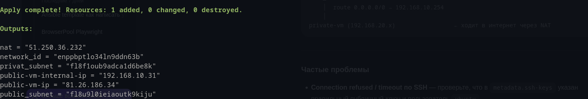
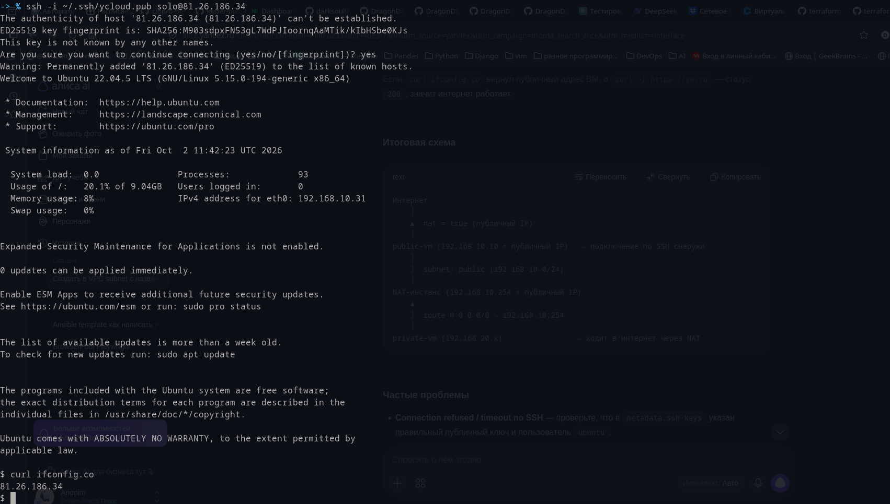
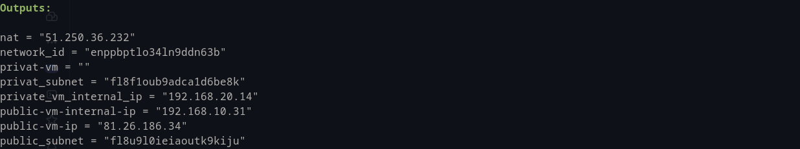
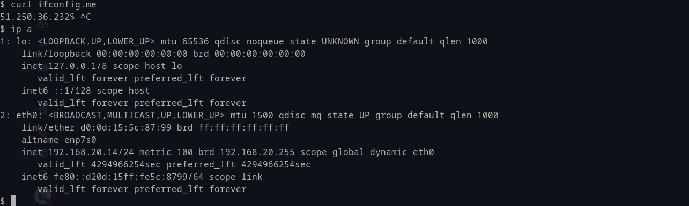
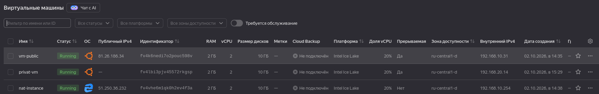
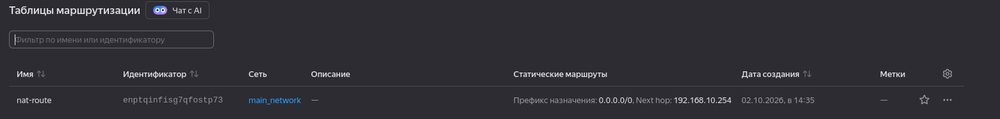

Задание 1. Yandex Cloud

Создана публичная ВМ:

Проверка доступа в интернет и ip:

Создана приватная ВМ без прямого доступа в интернет:

Проверка доступа в интренер и ip:

Список ВМ:

Список маршрутизации:

