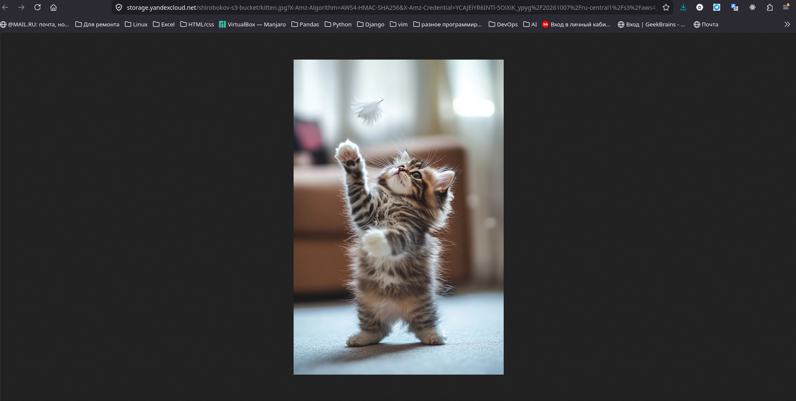
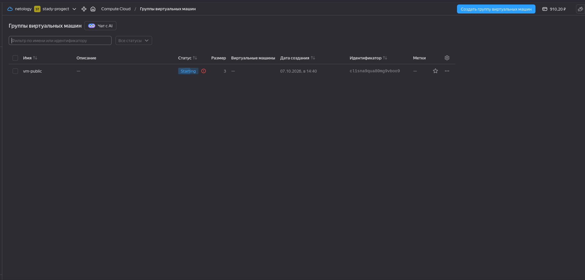

Задание 1. Yandex Cloud

Что нужно сделать

1. Создать бакет Object Storage и разместить в нём файл с картинкой:

Бакет создани и доступен из интернета:

2. Создать группу ВМ в public подсети фиксированного размера с шаблоном LAMP и веб-страницей, содержащей ссылку на картинку из бакета:

3. Подключить группу к сетевому балансировщику:

Как выполнить в условиях дедлайна? Запустил на создание гуппы и балансировщика, уже третья попытка. Terraform вылетает через 30 минут ожидания, а группа так и не создана. Прикладываю соответственно скриншот, не смог дождаться создания группы. Код также приложен.

`terraform validate` проходит без проблем:

