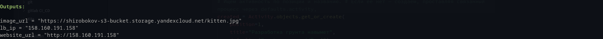
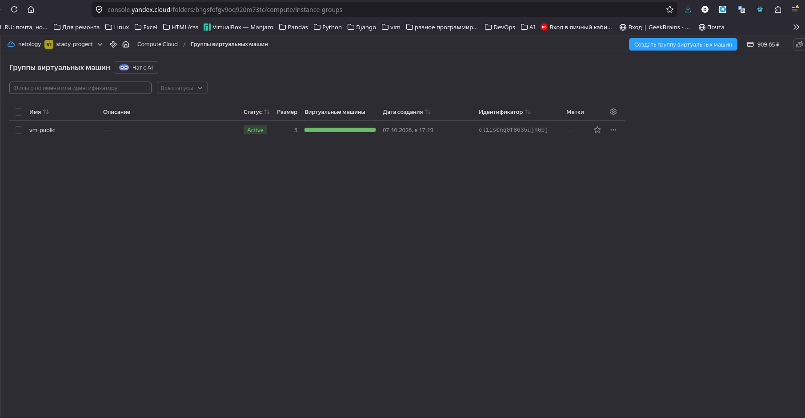
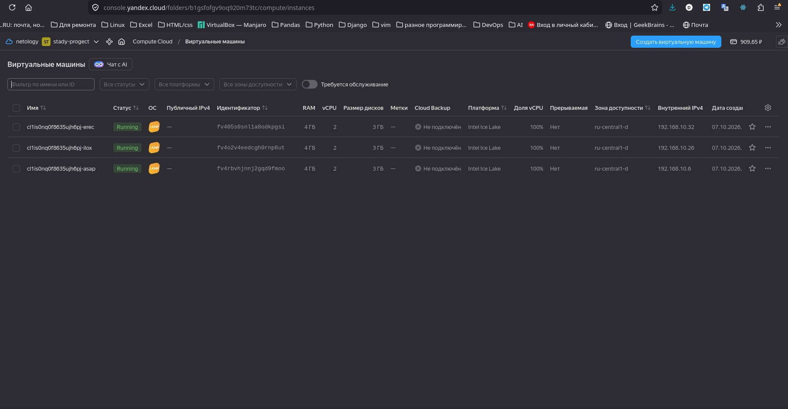
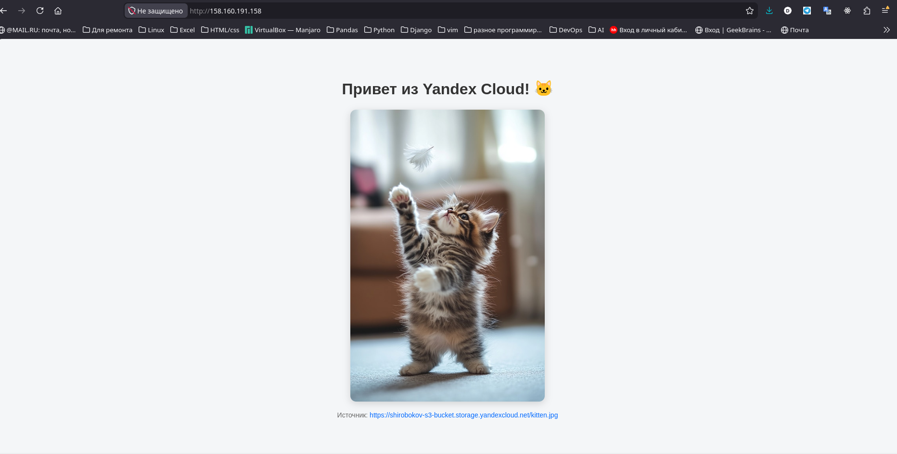
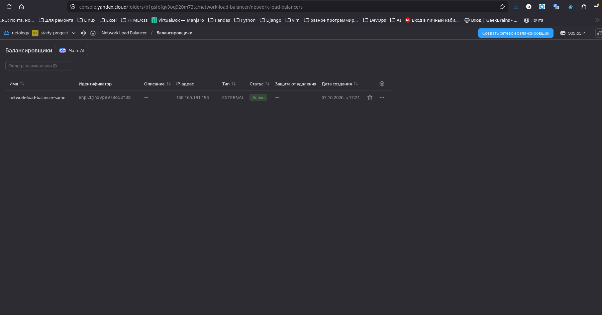
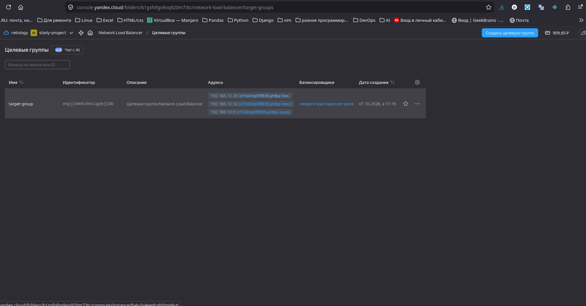

Задание 1. Yandex Cloud

Что нужно сделать

1. Создать бакет Object Storage и разместить в нём файл с картинкой:

Бакет создани и доступен из интернета:

2. Создать группу ВМ в public подсети фиксированного размера с шаблоном LAMP и веб-страницей, содержащей ссылку на картинку из бакета:
   Помогло внимательное чтение документации, раздел вопросов и ответов и добавление прав сервисному аккаунту:

3. Подключить группу к сетевому балансировщику:

